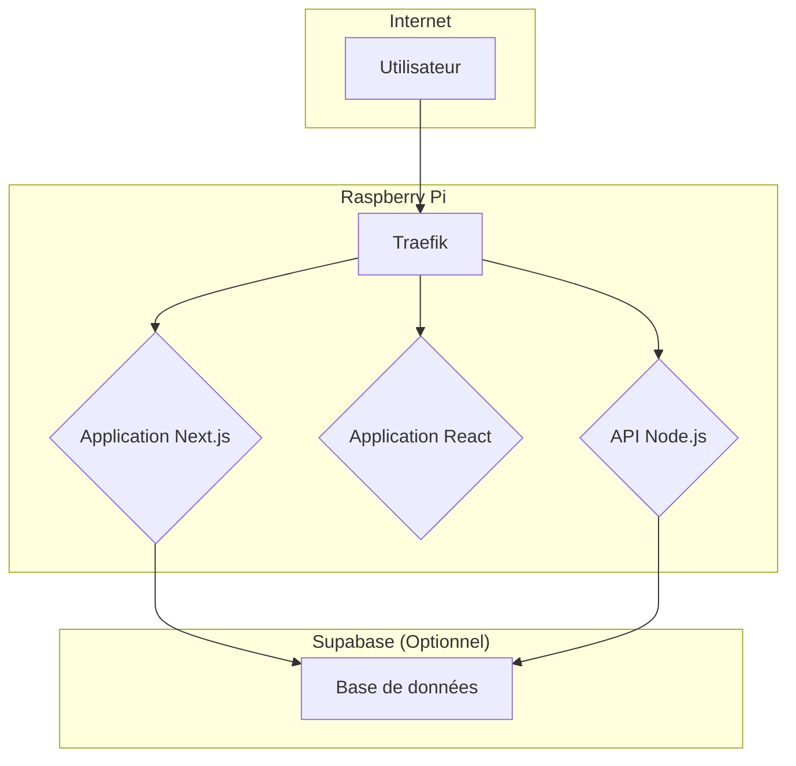

# 🚀 pi5-apps-stack - Déploiement d'applications web modernes sur Raspberry Pi 5

## Vue d'ensemble

`pi5-apps-stack` est une solution conçue pour simplifier le déploiement d'applications web modernes (React, Next.js, Node.js) sur votre Raspberry Pi 5. Grâce à une combinaison de Docker, Traefik et des scripts d'automatisation, vous pouvez déployer, gérer et mettre à jour vos applications en quelques commandes.

| Type d'application | Description | Idéal pour |
| :--- | :--- | :--- |
| **Next.js (SSR)** | Application rendue côté serveur, dynamique et performante. | Blogs, sites e-commerce, applications SaaS. |
| **React (SPA)** | Application à page unique, rapide et légère, rendue côté client. | Portfolios, landing pages, dashboards. |
| **Node.js (API)** | Backend ou API REST pour servir vos applications frontend. | API pour applications mobiles, microservices. |

## Prérequis

*   Un Raspberry Pi 5 (8Go de RAM ou plus recommandé).
*   Docker et Docker Compose installés.
*   Traefik déployé pour la gestion des noms de domaine et des certificats SSL.
*   Supabase (optionnel) pour une base de données et une authentification clé en main.

## Installation rapide

L'installation se fait en une seule ligne de commande :

```bash
curl -fsSL https://raw.githubusercontent.com/iamaketechnology/pi5-setup/main/pi5-apps-stack/scripts/01-apps-setup.sh | sudo bash
```

Pour des instructions détaillées, consultez le [guide d'installation](INSTALL.md).

## Architecture



## Templates disponibles

*   `nextjs-ssr`: Un template optimisé pour le déploiement d'applications Next.js en rendu côté serveur.
*   `react-spa`: Un template pour les applications React à page unique, servi avec Nginx.
*   `nodejs-api`: Un template de base pour une API Node.js avec Express.

## Scripts utilitaires

*   `deploy-nextjs-app.sh`: Déploie une nouvelle application Next.js.
*   `deploy-react-spa.sh`: Déploie une nouvelle application React.
*   `list-apps.sh`: Liste les applications déployées et leur consommation de RAM.
*   `remove-app.sh`: Supprime une application.
*   `update-app.sh`: Met à jour une application depuis son dépôt Git.
*   `logs-app.sh`: Affiche les logs d'une application.

## Capacité du Raspberry Pi 5 (16Go)

*   **10-15 applications Next.js (SSR)** (environ 100-150Mo de RAM par application).
*   **20-30 applications React (SPA)** (environ 10-20Mo de RAM par application).

## CI/CD avec Gitea Actions

Des workflows d'exemple sont fournis pour automatiser le déploiement de vos applications à chaque `git push`.

## Monitoring

Les applications sont automatiquement configurées avec des labels Prometheus pour être découvertes par votre stack de monitoring. Un tableau de bord Grafana est également disponible.

## Troubleshooting

Si vous rencontrez des problèmes, consultez la section de dépannage dans le [guide du débutant](GUIDE-DEBUTANT.md) et le [guide d'installation](INSTALL.md).
