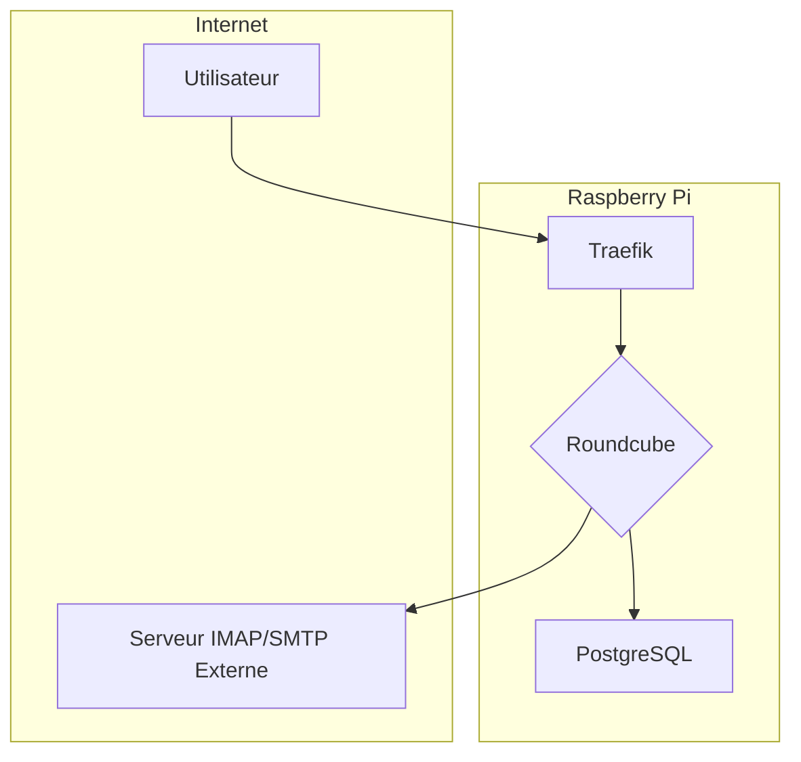
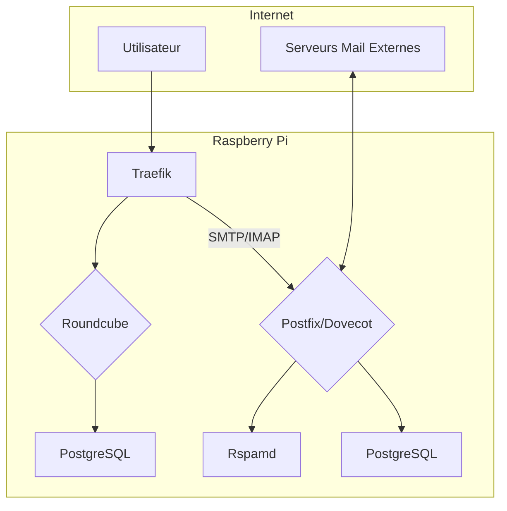

# 📧 PI5-EMAIL-STACK - Email Solutions pour Supabase

## Vue d'ensemble

Cette stack propose **deux approches** pour gérer les emails sur votre Raspberry Pi 5 :

1. **📤 Email Transactionnel** (Recommandé) - Envoi d'emails depuis vos applications Supabase via API (Resend, SendGrid, Mailgun)
2. **📮 Serveur Mail Self-Hosted** - Solution de webmail complète avec Roundcube (pour consultation d'emails)

---

## 🚀 Option 1 : Email Transactionnel (RECOMMANDÉ)

### Pour qui ?
✅ **Applications Supabase** qui ont besoin d'envoyer des emails (notifications, invitations, confirmations)
✅ **Débutants** qui veulent une solution simple et fiable
✅ **Développeurs** qui préfèrent une API moderne plutôt qu'un serveur SMTP

### Providers disponibles

| Provider | Gratuit | API | Analytics | Templates | Recommandé pour |
|----------|---------|-----|-----------|-----------|-----------------|
| **Resend** | 100/jour | ⭐⭐⭐⭐⭐ | Basiques | React Email | **Startups, devs** |
| **SendGrid** | 100/jour | ⭐⭐⭐⭐ | Avancées | Oui | Entreprises |
| **Mailgun** | 100/jour | ⭐⭐⭐ | Détaillées | Oui | Apps EU (RGPD) |

### Installation rapide

```bash
# Script unifié avec menu interactif
curl -fsSL https://raw.githubusercontent.com/iamaketechnology/pi5-setup/main/01-infrastructure/email/scripts/01-email-provider-setup.sh | sudo bash

# Ou avec provider pré-sélectionné
curl -fsSL https://raw.githubusercontent.com/iamaketechnology/pi5-setup/main/01-infrastructure/email/scripts/01-email-provider-setup.sh | sudo bash -s -- --provider resend
```

**Durée** : 2-3 minutes (inclut redémarrage du stack Supabase)

**📖 Documentation complète** : [EMAIL-PROVIDER-GUIDE.md](EMAIL-PROVIDER-GUIDE.md)

### Ce que ça fait

- ✅ Configure les variables d'environnement (`EMAIL_PROVIDER`, `EMAIL_API_KEY`, `EMAIL_FROM`)
- ✅ Injecte les variables dans tous vos Edge Functions Supabase
- ✅ Redémarre proprement le stack Supabase
- ✅ Vérifie que tout fonctionne

### Utilisation dans votre code

```typescript
// Dans n'importe quelle Edge Function
const EMAIL_API_KEY = Deno.env.get("EMAIL_API_KEY")!;
const EMAIL_FROM = Deno.env.get("EMAIL_FROM")!;

await fetch("https://api.resend.com/emails", {
  method: "POST",
  headers: {
    "Authorization": `Bearer ${EMAIL_API_KEY}`,
    "Content-Type": "application/json",
  },
  body: JSON.stringify({
    from: EMAIL_FROM,
    to: "user@example.com",
    subject: "Welcome!",
    html: "<h1>Hello!</h1>",
  }),
});
```

---

## 📮 Option 2 : Serveur Mail Self-Hosted

### Pour qui ?
✅ **Utilisateurs avancés** qui veulent un contrôle total
✅ **Self-hosters** qui veulent tout héberger localement
✅ **Consultations d'emails** (webmail type Gmail)

### Scénarios disponibles

| Scénario | Description | Idéal pour |
| :--- | :--- | :--- |
| **Client Web Externe** | Déploie **Roundcube** comme une interface web pour consulter vos emails hébergés chez un fournisseur externe (Gmail, Outlook, ProtonMail). | Les débutants qui veulent une interface web unifiée pour leurs comptes existants sans gérer la complexité d'un serveur mail. |
| **Serveur Mail Complet** | Déploie une solution de messagerie complète avec **Postfix** (envoi), **Dovecot** (réception/stockage), **Rspamd** (anti-spam) et **Roundcube** (interface web). | Les utilisateurs avancés qui souhaitent avoir leurs propres adresses email (@votredomaine.com) et un contrôle total sur leurs données. |

## Caractéristiques

**Scénario 1: Client Web Externe**
*   **Interface Unifiée** : Accédez à tous vos comptes email (Gmail, Outlook, etc.) depuis une seule interface web.
*   **Léger et Rapide** : Roundcube est une solution de webmail performante et légère.
*   **Sécurisé** : La connexion à votre fournisseur de messagerie est sécurisée par SSL/TLS.
*   **Facile à Installer** : Déploiement en une seule commande.

**Scénario 2: Serveur Mail Complet**
*   **Souveraineté des Données** : Contrôle total sur vos emails, qui sont stockés localement sur votre Raspberry Pi.
*   **Adresses Email Personnalisées** : Créez des adresses email avec votre propre nom de domaine (ex: `contact@votredomaine.com`).
*   **Sécurité Renforcée** : Inclut des mécanismes de sécurité modernes comme SPF, DKIM et DMARC pour lutter contre le spam et l'usurpation d'identité.
*   **Anti-Spam Intelligent** : Rspamd analyse et filtre les emails indésirables.
*   **Gestion des Utilisateurs** : Créez, modifiez et supprimez des comptes email facilement.

## Architecture

### Scénario 1: Client Web Externe



### Scénario 2: Serveur Mail Complet



## Prérequis

*   Un Raspberry Pi 5 (4Go de RAM minimum pour le scénario 2).
*   Docker et Docker Compose installés.
*   Traefik déployé pour la gestion des noms de domaine et des certificats SSL.
*   Un nom de domaine (obligatoire pour le scénario 2).

## Installation rapide

L'installation se fait en une seule ligne de commande. Choisissez le scénario qui vous convient.

**Scénario 1: Client Web Externe**
```bash
curl -fsSL https://raw.githubusercontent.com/iamaketechnology/pi5-setup/main/pi5-email-stack/scripts/01-roundcube-deploy-external.sh | sudo bash
```

**Scénario 2: Serveur Mail Complet**
```bash
curl -fsSL https://raw.githubusercontent.com/iamaketechnology/pi5-setup/main/pi5-email-stack/scripts/01-roundcube-deploy-full.sh | sudo bash
```

Pour des instructions détaillées, consultez le [guide d'installation](INSTALL.md).

## Composants

*   **Roundcube**: Un client de messagerie web moderne et rapide. C'est votre interface pour lire et envoyer des emails.
*   **Postfix**: Un agent de transfert de courrier (MTA) qui se charge de l'envoi et de la réception des emails. C'est le "facteur" de votre serveur.
*   **Dovecot**: Un serveur IMAP et POP3 qui permet à votre client de messagerie (Roundcube, Thunderbird, etc.) d'accéder aux emails stockés sur le serveur. C'est la "boîte aux lettres".
*   **Rspamd**: Un système de filtrage de spam rapide et open-source. Il analyse les emails entrants pour vous protéger du spam.
*   **PostgreSQL**: Une base de données relationnelle utilisée par Roundcube et le serveur de messagerie pour stocker les informations des utilisateurs, les contacts, etc.

## Configuration

La configuration principale se fait via le fichier `.env` qui est généré lors de l'installation. Vous pouvez y définir votre nom de domaine, les paramètres de connexion à votre fournisseur de messagerie (pour le scénario 1), et d'autres options.

## Maintenance

Des scripts sont fournis pour faciliter la maintenance de votre serveur de messagerie.

*   **Backup**: `scripts/maintenance/email-backup.sh`
*   **Restore**: `scripts/maintenance/email-restore.sh`
*   **Healthcheck**: `scripts/maintenance/email-healthcheck.sh`
*   **Mise à jour**: `scripts/maintenance/email-update.sh`
*   **Collecte des logs**: `scripts/maintenance/email-logs.sh`

## Sécurité

La sécurité est un aspect crucial de l'hébergement de messagerie. Cette stack intègre plusieurs mécanismes pour sécuriser votre serveur :

*   **TLS**: Le trafic entre votre navigateur et Roundcube, ainsi qu'entre les serveurs de messagerie, est chiffré avec TLS (via Traefik).
*   **SPF (Sender Policy Framework)**: Empêche les spammeurs d'envoyer des emails en votre nom.
*   **DKIM (DomainKeys Identified Mail)**: Ajoute une signature numérique à vos emails pour prouver leur authenticité.
*   **DMARC (Domain-based Message Authentication, Reporting, and Conformance)**: Indique aux serveurs de messagerie ce qu'ils doivent faire des emails qui échouent aux vérifications SPF et DKIM.

## Monitoring

La stack est conçue pour s'intégrer avec une solution de monitoring basée sur Prometheus et Grafana. Un tableau de bord Grafana est disponible pour visualiser les statistiques de votre serveur de messagerie.

## Troubleshooting

Si vous rencontrez des problèmes, consultez la section de dépannage dans le [guide du débutant](GUIDE-DEBUTANT.md) et le [guide d'installation](INSTALL.md).

## Ressources

*   [Guide du Débutant](GUIDE-DEBUTANT.md)
*   [Guide d'Installation](INSTALL.md)
*   [Comparaison des Scénarios](docs/SCENARIOS-COMPARISON.md)
