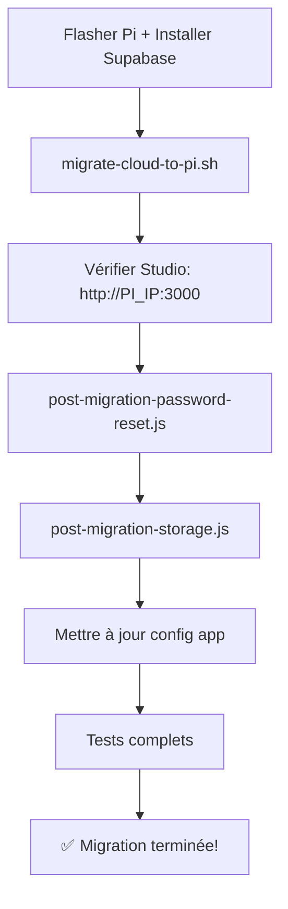

# 📦 Migration Supabase Cloud → Pi

> **Tous les outils pour migrer votre Supabase Cloud vers le Raspberry Pi**

---

## 🎯 Quick Start (3 étapes)

```bash
# 1️⃣ Migration base de données (15 min)
cd scripts/
./01-migrate-cloud-to-pi.sh

# 2️⃣ Reset passwords (5 min)
npm install
node 02-post-migration-password-reset.js

# 3️⃣ Migration fichiers (10 min)
node 03-post-migration-storage.js
```

**Résultat**: Base de données + fichiers migrés, prêt à l'emploi! 🎉

---

## 📂 Structure du Dossier

```
migration/
├── README.md                    # ⭐ Vous êtes ici
│
├── 📚 docs/                     # Documentation
│   ├── guides/                  # Guides de migration
│   │   ├── GUIDE-MIGRATION-SIMPLE.md      # ⭐ Débutants (commencez ici)
│   │   ├── MIGRATION-RAPIDE.md            # Quick reference
│   │   └── MIGRATION-CLOUD-TO-PI.md       # Guide complet
│   │
│   ├── post-migration/          # Après la migration
│   │   └── POST-MIGRATION.md              # Passwords, Storage, OAuth
│   │
│   └── advanced/                # Documentation avancée
│       ├── SCHEMAS-EXPLAINED.md           # Comprendre les schémas
│       └── WORKFLOW-DEVELOPPEMENT.md      # Dev workflow
│
├── 🛠️ scripts/                  # Scripts principaux
│   ├── 01-migrate-cloud-to-pi.sh          # ⭐ Migration BDD (v1.7.0)
│   ├── 02-post-migration-password-reset.js # Reset passwords
│   ├── 03-post-migration-storage.js       # Migration fichiers
│   └── package.json                       # Config npm
│
└── 🔧 tools/                    # Outils de diagnostic
    ├── diagnose-schema.sh                 # Diagnostic post-migration
    └── fix-storage-rls.sql                # Fix RLS Storage
```

---

## 📚 Documentation

### 🟢 Pour Débutants (Commencez ici!)

**[📖 docs/guides/GUIDE-MIGRATION-SIMPLE.md](docs/guides/GUIDE-MIGRATION-SIMPLE.md)**
- Langage simple, pas de jargon technique
- Migration en 3 étapes
- ~15 minutes chrono
- **→ Cliquez ici pour commencer!**

### 🔵 Pour Utilisateurs Expérimentés

**[⚡ docs/guides/MIGRATION-RAPIDE.md](docs/guides/MIGRATION-RAPIDE.md)**
- TL;DR avec commandes essentielles
- ~5 minutes de lecture

### 🟣 Documentation Complète

**[📘 docs/guides/MIGRATION-CLOUD-TO-PI.md](docs/guides/MIGRATION-CLOUD-TO-PI.md)**
- Guide technique exhaustive
- Tous les scénarios
- Troubleshooting avancé

### 🟡 Après Migration

**[✅ docs/post-migration/POST-MIGRATION.md](docs/post-migration/POST-MIGRATION.md)**
- Reset des mots de passe utilisateurs
- Migration des fichiers Storage
- Configuration OAuth
- Mise à jour de l'application

### 🟠 Documentation Avancée

**[🔍 docs/advanced/SCHEMAS-EXPLAINED.md](docs/advanced/SCHEMAS-EXPLAINED.md)**
- Comprendre les schémas Supabase
- Lesquels sont nécessaires?
- Optimisation espace disque

**[💻 docs/advanced/WORKFLOW-DEVELOPPEMENT.md](docs/advanced/WORKFLOW-DEVELOPPEMENT.md)**
- Développer avec Supabase Pi
- Best practices
- Testing & debugging

---

## 🛠️ Scripts de Migration

### Script Principal: Migration Base de Données

```bash
cd scripts/

# Migration standard
./01-migrate-cloud-to-pi.sh

# Options avancées
./01-migrate-cloud-to-pi.sh --schema MonProjet    # Schéma personnalisé
./01-migrate-cloud-to-pi.sh --dry-run             # Mode test
```

**Ce script migre:**
- ✅ Tables et structure
- ✅ Données (toutes les rows)
- ✅ RLS Policies
- ✅ Fonctions et triggers
- ✅ Utilisateurs (emails, métadonnées)
- ✅ **Nouveau v1.7.0:** Auto-fix Storage RLS

### Scripts Post-Migration

```bash
cd scripts/

# 1. Installer dépendances (une seule fois)
npm install

# 2. Reset passwords (envoie emails)
node 02-post-migration-password-reset.js

# 3. Migration fichiers Storage
node 03-post-migration-storage.js
```

---

## 🔧 Outils de Diagnostic

### Diagnostic Complet

```bash
cd tools/

# Vérifier l'état de la migration
./diagnose-schema.sh 192.168.1.74 monprojet
```

**Affiche:**
- Schémas PostgreSQL existants
- Nombre de tables par schéma
- Tables dans le schéma cible
- Utilisateurs Auth
- Résumé et recommandations

### Fix Storage RLS (si problème API)

```bash
cd tools/

# Réparer les policies Storage
ssh pi@IP "PGPASSWORD=\$PASSWORD psql -h localhost -U postgres -d postgres" < fix-storage-rls.sql
```

**Corrige:**
- Policies RLS pour `service_role`
- Accès API Storage bloqué
- Erreur "row-level security policy"

---

## 📋 Informations Nécessaires

Avant de commencer, préparez:

### Supabase Cloud (Source)
1. **URL**: `https://xxxxx.supabase.co`
   - Dashboard → Settings → General
2. **Service Role Key**: `eyJ...`
   - Settings → API → `service_role` (secret)
3. **Database Password**:
   - Settings → Database → Connection string

### Raspberry Pi (Destination)
4. **IP**: `192.168.1.74`
   - Commande sur le Pi: `hostname -I`
5. **SSH configuré**:
   - Test: `ssh pi@192.168.1.74`

---

## 📊 Ce qui est Migré

### ✅ Automatiquement (migrate-cloud-to-pi.sh)

| Élément | Migré | Notes |
|---------|-------|-------|
| Tables & structure | ✅ | Complet |
| Données (rows) | ✅ | Toutes |
| RLS Policies | ✅ | Recréées |
| Fonctions SQL | ✅ | Avec triggers |
| Utilisateurs | ✅ | Emails + métadonnées |
| Storage RLS | ✅ | **Nouveau v1.7.0** |

### ⚠️ Migration Manuelle Requise

| Élément | Script | Raison |
|---------|--------|--------|
| Mots de passe | `post-migration-password-reset.js` | Hashés (non exportables) |
| Fichiers Storage | `post-migration-storage.js` | Binaires (non dans dump SQL) |

---

## 🔄 Workflow Recommandé



**Temps total:** ~30 minutes

---

## 🆘 Support & Troubleshooting

### Documentation

- **Problème durant migration?**
  → [docs/guides/MIGRATION-CLOUD-TO-PI.md#troubleshooting](docs/guides/MIGRATION-CLOUD-TO-PI.md)

- **Problème après migration?**
  → [docs/post-migration/POST-MIGRATION.md#problèmes-courants](docs/post-migration/POST-MIGRATION.md)

- **Questions sur les schémas?**
  → [docs/advanced/SCHEMAS-EXPLAINED.md](docs/advanced/SCHEMAS-EXPLAINED.md)

### Outils de Diagnostic

```bash
# Diagnostic complet
tools/diagnose-schema.sh 192.168.1.74 certidoc

# Fix Storage RLS
ssh pi@IP "..." < tools/fix-storage-rls.sql
```

### Communauté

- 💬 [GitHub Issues](https://github.com/iamaketechnology/pi5-setup/issues)
- 📧 Support: [Créer une issue](https://github.com/iamaketechnology/pi5-setup/issues/new)

---

## 🎯 Résultat Final

Après migration complète:

| Avant (Cloud) | Après (Pi) |
|---------------|------------|
| ~25€-300€/mois | **0€/mois** |
| Latence réseau | **< 1ms** (local) |
| Limite données | **Illimité** |
| Limite bande passante | **Illimitée** |
| Contrôle total | ✅ **100%** |

**Économie annuelle:** **300€ - 3600€** 🎉

---

## 🚀 Prêt à Commencer?

### Option 1: Débutant (Recommandé)
👉 **[Ouvrir le Guide Simple](docs/guides/GUIDE-MIGRATION-SIMPLE.md)**

### Option 2: Expérimenté
👉 **[Guide Rapide](docs/guides/MIGRATION-RAPIDE.md)**

### Option 3: Expert
```bash
cd scripts/
./01-migrate-cloud-to-pi.sh
```

---

<p align="center">
  <strong>📦 Migration Supabase Cloud → Pi en 15 minutes! 🎉</strong><br>
  <em>100% automatisé • 100% Open Source • 0€/mois</em>
</p>

---

**Version:** 1.7.0 | **Dernière mise à jour:** 2025-10-06
