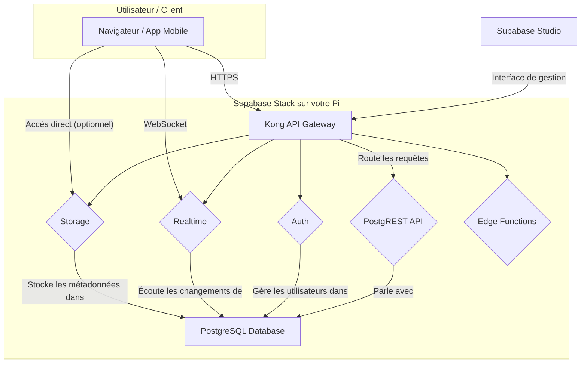

# 🎓 Guide Débutant : Supabase

> **Pour qui ?** : Débutants, explications simples, pas de prérequis technique

---

## 📖 C'est Quoi Supabase ?

### Analogie Simple

Imaginez que vous construisez une maison numérique (une application, un site web). Vous avez besoin de fondations solides et de services essentiels :

*   **Les fondations (la base de données)** : Un endroit sûr et organisé pour stocker toutes vos informations, comme une bibliothèque géante avec un système de rangement impeccable.
*   **La porte d'entrée (l'authentification)** : Un système de sécurité qui vérifie qui a le droit d'entrer, avec une liste d'invités et des clés personnalisées.
*   **Le service de livraison (l'API)** : Un coursier ultra-efficace qui va chercher et dépose des informations entre votre maison (l'application) et la bibliothèque (la base de données).
*   **Le garde-meubles (le stockage)** : Un espace pour entreposer des objets plus volumineux comme des photos, des vidéos ou des documents.
*   **Le téléphone (le temps réel)** : Une ligne directe qui vous notifie instantanément dès qu'il y a du nouveau, sans que vous ayez à demander.

**Supabase, c'est tout ça en une seule boîte.** C'est un ensemble d'outils qui vous fournit toutes ces fondations prêtes à l'emploi. Au lieu de construire chaque service vous-même, ou de les louer à des géants comme Google (Firebase) ou Amazon (AWS), vous hébergez tout sur votre propre Raspberry Pi. Vous êtes le propriétaire de votre maison numérique, de A à Z.

### En Termes Techniques

Supabase est une alternative open-source à Firebase. Il ne s'agit pas d'un produit unique, mais d'une suite d'outils open-source intégrés les uns aux autres :

*   **Base de données** : Utilise **PostgreSQL**, une des bases de données relationnelles les plus robustes et populaires au monde.
*   **API REST** : **PostgREST** génère automatiquement une API RESTful à partir de votre schéma de base de données.
*   **Authentification** : **GoTrue** est un service basé sur JWT pour gérer les utilisateurs et l'émission de tokens.
*   **Stockage** : Un service compatible S3 pour gérer le stockage de fichiers et de médias.
*   **Temps réel** : Un serveur WebSocket qui permet d'écouter les changements dans la base de données en temps réel.
*   **Fonctions Edge** : Un environnement Deno pour exécuter du code serverless.

Le tout est orchestré via une interface web claire, le **Supabase Studio**.

---

## 🎯 Cas d'Usage Concrets

### Scénario 1 : Créer un Blog Personnel
*   **Contexte** : Vous voulez lancer un blog pour partager vos passions, avec des articles, des catégories et des commentaires.
*   **Solution** : Supabase fournit la base de données pour stocker les articles, l'authentification pour que vous seul puissiez poster, et une API pour que votre site (Next.js, Astro, etc.) puisse afficher les articles. Les visiteurs peuvent laisser des commentaires qui apparaissent en temps réel.

### Scénario 2 : Lancer une Application de Suivi d'Habitudes
*   **Contexte** : Vous voulez créer une application mobile (Flutter, React Native) pour suivre vos habitudes quotidiennes.
*   **Solution** : Chaque utilisateur s'inscrit et se connecte via Supabase Auth. Ses habitudes sont stockées dans la base de données PostgreSQL. L'API permet à l'application de marquer une habitude comme "faite" et de visualiser les statistiques de progression.

### Scénario 3 : Développer un Portfolio avec un Formulaire de Contact
*   **Contexte** : Vous êtes développeur et vous voulez un site pour présenter vos projets, avec un formulaire de contact sécurisé.
*   **Solution** : Le site est statique (React, Vue), mais le formulaire de contact utilise une Edge Function Supabase pour envoyer un email sans exposer de clés d'API côté client.

### Scénario 4 : Créer une Galerie Photo Familiale
*   **Contexte** : Vous voulez un espace privé pour partager des photos de famille, avec des albums et un accès restreint.
*   **Solution** : Supabase Storage est utilisé pour uploader et stocker les photos. La base de données gère la structure des albums. L'authentification et les politiques de sécurité (RLS) garantissent que seuls les membres de la famille peuvent voir les photos.

### Scénario 5 : Prototyper une Idée de Startup (MVP)
*   **Contexte** : Vous avez une idée d'application SaaS mais vous voulez la tester rapidement sans investir des milliers d'euros.
*   **Solution** : Supabase vous donne un backend complet en quelques minutes. Vous pouvez vous concentrer sur le développement de l'interface utilisateur et valider votre idée auprès de vrais utilisateurs. Si le projet décolle, vous pourrez facilement migrer vers une infrastructure plus puissante.

---

## 🏗️ Comment Ça Marche ?

### Architecture Simplifiée

Voici un diagramme textuel qui montre comment les services interagissent :



### Composants Principaux

*   **PostgreSQL** : Le cerveau de l'opération. C'est là que toutes vos données structurées sont stockées.
*   **Kong** : Le portier. C'est la seule porte d'entrée pour toutes les requêtes API. Il les vérifie et les dirige vers le bon service.
*   **PostgREST** : Le traducteur. Il transforme votre base de données en une API REST que votre application peut comprendre.
*   **GoTrue (Auth)** : Le videur. Il gère les inscriptions, les connexions et s'assure que seuls les utilisateurs autorisés accèdent aux données.
*   **Realtime** : Le rapporteur. Il espionne la base de données et crie "Hé, quelque chose a changé !" à toutes les applications qui écoutent.
*   **Storage** : L'archiviste. Il s'occupe des fichiers volumineux (images, PDFs) et les lie à votre base de données.
*   **Edge Functions** : Le bricoleur. Il exécute des petits bouts de code à la demande pour des tâches spécifiques.
*   **Supabase Studio** : Le tableau de bord. C'est votre centre de commande pour tout voir et tout gérer depuis une interface web.

---

## 🚀 Premiers Pas

### Installation

Pour installer Supabase, suivez le guide d'installation détaillé :

➡️ **[Consulter le Guide d'Installation de Supabase](supabase-setup.md)**

### Premier Test

Une fois l'installation terminée, la première chose à faire est de vous connecter au Supabase Studio.

**Étape 1** : Récupérer l'URL et les identifiants

À la fin de l'installation, le script affiche un résumé avec les informations de connexion. Si vous l'avez manqué, vous pouvez les retrouver avec cette commande sur votre Pi :

```bash
sudo bash /opt/pi5-setup/common-scripts/09-stack-manager.sh --stack supabase --info
```

**Étape 2** : Se connecter au Studio

Ouvrez un navigateur web sur votre ordinateur et entrez l'URL du Studio (ex: `http://192.168.1.100:3000`). Utilisez l'email et le mot de passe fournis pour vous connecter.

**Étape 3** : Créer une table "todos"

1.  Dans le menu de gauche, cliquez sur l'icône "Table Editor".
2.  Cliquez sur "New table".
3.  Nommez la table `todos`.
4.  Laissez la sécurité RLS (Row Level Security) activée pour le moment.
5.  Ajoutez une colonne `task` de type `text`.
6.  Ajoutez une colonne `is_complete` de type `bool` avec la valeur par défaut `false`.
7.  Cliquez sur "Save".

**Résultat attendu** : Votre table `todos` est créée et prête à recevoir des données. Vous venez de créer votre premier modèle de données sans écrire une seule ligne de SQL !

---

## 🔐 Sécurité (Auth, RLS, JWT)

### Authentification (Auth)

Supabase gère l'authentification via son service **GoTrue**. Quand un utilisateur s'inscrit, GoTrue crée une entrée dans la table `auth.users` et lui retourne un **JWT (JSON Web Token)**. Ce token est une sorte de passeport numérique qui doit être inclus dans chaque requête API pour prouver l'identité de l'utilisateur.

### Row Level Security (RLS)

La RLS est la fonctionnalité de sécurité la plus puissante de Supabase. C'est une couche de sécurité directement dans votre base de données PostgreSQL. Imaginez des règles qui disent : "Seul le propriétaire d'une ligne a le droit de la voir ou de la modifier".

**Exemple de politique RLS pour la table `todos`** :

```sql
-- Les utilisateurs peuvent voir leurs propres tâches
CREATE POLICY "Enable read access for own todos" ON "public"."todos"
AS PERMISSIVE FOR SELECT
TO authenticated
USING (auth.uid() = user_id);

-- Les utilisateurs peuvent créer des tâches pour eux-mêmes
CREATE POLICY "Enable insert for own todos" ON "public"."todos"
AS PERMISSIVE FOR INSERT
TO authenticated
WITH CHECK (auth.uid() = user_id);
```

> **Important** : Par défaut, la RLS est activée et bloque tout. Vous devez explicitement créer des politiques pour autoriser l'accès.

---

## 📊 Base de données (PostgreSQL, PostgREST)

Le cœur de Supabase est **PostgreSQL**. Vous pouvez interagir avec la base de données de deux manières :

1.  **Via l'API PostgREST** : C'est la méthode recommandée. PostgREST expose votre base de données sous forme d'API RESTful, vous permettant d'utiliser des verbes HTTP (`GET`, `POST`, `PATCH`, `DELETE`) pour manipuler les données.
2.  **Directement en SQL** : Pour des opérations complexes, vous pouvez toujours écrire du SQL pur, soit dans le Studio, soit en vous connectant directement à la base de données.

---

## 📁 Storage (upload fichiers)

Le service de stockage de Supabase vous permet de gérer des fichiers volumineux. Les fichiers sont organisés en "buckets". Chaque bucket peut avoir ses propres règles de sécurité.

**Exemple** : Uploader un avatar d'utilisateur.

```javascript
const { data, error } = await supabase.storage
  .from('avatars') // Nom du bucket
  .upload(`public/${userId}.png`, file, {
    cacheControl: '3600',
    upsert: true, // Remplace le fichier s'il existe déjà
  });
```

---

## ⚡ Realtime (WebSocket)

Le service Realtime diffuse les changements de votre base de données via des WebSockets. Vous pouvez vous "abonner" à des changements sur une table, une ligne ou même une colonne spécifique.

**Exemple** : Être notifié quand une nouvelle tâche est ajoutée.

```javascript
const channel = supabase.channel('todos-channel');

channel
  .on(
    'postgres_changes',
    { event: 'INSERT', schema: 'public', table: 'todos' },
    (payload) => {
      console.log('Nouvelle tâche !', payload.new);
      // Mettre à jour l'interface utilisateur ici
    }
  )
  .subscribe();
```

---

## 🎛️ Studio UI (visite guidée)

Le Supabase Studio est votre meilleur ami. Prenez le temps de l'explorer :

*   **Table Editor** : Visualisez et modifiez vos données comme dans un tableur.
*   **SQL Editor** : Écrivez et exécutez des requêtes SQL.
*   **Authentication** : Gérez vos utilisateurs, les fournisseurs OAuth et les templates d'email.
*   **Storage** : Parcourez vos buckets et gérez vos fichiers.
*   **API Docs** : Supabase génère automatiquement une documentation pour votre API. Vous pouvez même y tester les endpoints !
*   **Database** : Gérez les rôles, les politiques RLS et les extensions PostgreSQL.

---

## 🐛 Dépannage Débutants

### Problème 1 : "Failed to fetch" ou erreur réseau
*   **Symptôme** : Votre application frontend ne peut pas se connecter à l'API Supabase.
*   **Cause** : Souvent, l'URL de l'API est `localhost`, ce qui ne fonctionne que si l'application tourne sur le Pi lui-même. Depuis un autre appareil, il faut utiliser l'adresse IP du Pi.
*   **Solution** : Remplacez `localhost` par l'adresse IP de votre Raspberry Pi (ex: `http://192.168.1.100:8000`) dans la configuration de votre client Supabase.

### Problème 2 : "permission denied for table ..."
*   **Symptôme** : Vous obtenez une erreur 403 ou 404 en essayant d'accéder à une table.
*   **Cause** : La Row Level Security (RLS) est activée, mais vous n'avez pas défini de politique pour autoriser l'accès.
*   **Solution** : Allez dans le Studio > Authentication > Policies et créez une politique qui autorise la lecture (`SELECT`) pour la table en question. Pour commencer, vous pouvez créer une politique très permissive : `USING (true)`.

### Problème 3 : Les données n'apparaissent pas en temps réel
*   **Symptôme** : Les changements dans la base de données ne sont pas diffusés en temps réel.
*   **Cause** : Vous n'avez pas activé la diffusion pour la table concernée.
*   **Solution** : Allez dans le Studio > Database > Replication. Assurez-vous que votre table est bien activée pour la réplication.

### Problème 4 : Les Edge Functions retournent une erreur 500
*   **Symptôme** : L'appel à une Edge Function échoue.
*   **Cause** : Il peut y avoir une erreur dans le code de la fonction ou un problème de configuration.
*   **Solution** : Utilisez la commande `docker compose logs -f supabase-edge-functions` sur votre Pi pour voir les logs d'erreurs détaillés de la fonction.

### Problème 5 : Mot de passe oublié pour le Studio
*   **Symptôme** : Vous ne pouvez plus vous connecter au Supabase Studio.
*   **Cause** : Vous avez oublié le mot de passe défini à l'installation.
*   **Solution** : Connectez-vous en SSH à votre Pi et utilisez le script de maintenance pour réinitialiser le mot de passe.

---

## ✅ Checklist Progression

### Niveau Débutant
- [ ] Installation réussie de la stack Supabase.
- [ ] Connexion au Supabase Studio.
- [ ] Création d'une table et ajout de colonnes.
- [ ] Insertion et lecture de données via le Studio.
- [ ] Connexion d'une application frontend simple à l'API.

### Niveau Intermédiaire
- [ ] Mise en place de l'authentification (inscription/connexion).
- [ ] Création de politiques RLS pour sécuriser l'accès aux données.
- [ ] Utilisation du Storage pour uploader des fichiers.
- [ ] Création de relations entre les tables (clés étrangères).

### Niveau Avancé
- [ ] Mise en place d'abonnements Realtime.
- [ ] Écriture et déploiement d'une Edge Function.
- [ ] Création de fonctions et de déclencheurs (triggers) en SQL.
- [ ] Optimisation des requêtes pour les performances.

---

## 📚 Ressources d'Apprentissage

### Documentation Officielle
*   [Documentation Supabase](https://supabase.com/docs) : La référence absolue.
*   [Guides Supabase](https://supabase.com/docs/guides) : Des tutoriels pour des cas d'usage spécifiques.
*   [PostgreSQL Tutorial](https://www.postgresqltutorial.com/) : Pour apprendre les bases du SQL.

### Tutoriels Vidéo
*   [Supabase (Official YouTube Channel)](https://www.youtube.com/c/Supabase) : Des dizaines de vidéos courtes et efficaces.
*   [Fireship.io - Supabase in 100 Seconds](https://www.youtube.com/watch?v=r4H93i32s18) : Un résumé ultra-rapide.

### Communautés
*   [Discord Supabase](https://discord.supabase.com/) : Très actif, idéal pour poser des questions.
*   [GitHub Discussions](https://github.com/supabase/supabase/discussions) : Pour des questions plus techniques.
*   [Reddit r/Supabase](https://www.reddit.com/r/Supabase/) : Pour partager des projets et des astuces.
